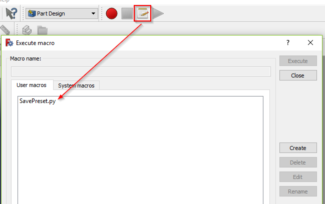
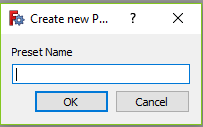
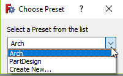

# FreeCAD-PreferencesPresets
FreeCAD Macros to store different presets for the Preferences

## Motivation
FreeCAD has a lot of configuration options. So you can adapt it to your needs easily. Some tasks might need specific Settings. E.g. when creating a small part in PartDesign you will likely set your units to "mm", but when building a house "cm" or "m" will be more suitable. Changing the Unit settings alone is often not enough, you might also want to change the number of decimals, the Draft grid size or even some colors when working on an architctural project. And set it back when switching to a PartDesign project.

It will be tedious to remember every setting and change it back and forth when switching between different tasks.

## Solution
Lukily FreeCAD has some tools to help us with this problem.
 - FreeCAD has a config directory, "%APPDATA%\FreeCAD" on windows (Lets call it ``ConfigDir``), where a user.cfg and a system.cfg file is stored. This contains all our preferences
 - FreeCAD can be started with a --user-cfg and --syste-cfg flag that indicates what config files to load on startup
The ``SavePresets`` macro utilizes these two things to achieve our goals.

## Installation
The macro is not in the addons manager so far. So simply download the macro from this repository and follow the installation guide: https://www.freecadweb.org/wiki/How_to_install_macros

## Usage
When starting with a fresh copy of FreeCAD all your Preferences will be the default. You might want to start by setting things you need regardless of the project type you are working on. This might be things like
- the number of backup files to store
- antialiasing settings
- line colors
- icon sizes
- language
or whatever comes to your mind.

Next you run the macro by clicking the macro icon in the toolbar and double click on the macro entry:

**The macro will simply use all the preferences in the actual running FreeCAD instance and copy them to a separate directory.**

When no presets are available the "Create new Preset" Dialog is shown.

Simply enter a name and click OK.
**Maybe its best to not use and special characters or blanks in the name, as this will be used as the name of a folder and this can cause problems later on**

Now a directory selector will be shown. Select a directory where the start command (A .bat file on windows or a .sh file on Linux), to run FreeCAD with the ``--user-cfg`` and ``--syste-cfg`` arguments, will be created.

When done two things have been created for you:
1. A executable file named "FreeCAD_<PresetName>.bat|sh" in the directory you selected in the last step
2. A user.cfg and system.cfg File in ``ConfigDir/ConfigPresets/<PresetName>``

When starting the Macro when there are some presets already available, you will get something like this

You can choose to create a new preset or override a existing one.

**Attention: Choosing a existing preset will simply override it with the settings of your current FreeCAD instance. So every Preset specific setting will be lost.** Check https://github.com/furti/FreeCAD-PreferencesPresets/issues/1 to see when a more advanced solution is available.

## What's next?
When you have saved a preset you can start the command created for you. Now all the settings stored inside that preset should be available in the FreeCAD instance. When changing some preferences, they will be stored inside your preset and not in the default config location. So you can do all your preset specific task now.

You will also have your basic FreeCAD configuration available by starting FreeCAD. So you can create another preset from it or simply work without presets applied.

You can even work with both instances at the same time as they will not override each others preferences.
